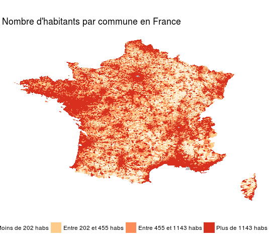

A test of choropleth map of french cities by population with R.

- Documentation : https://github.com/tidyverse/ggplot2/wiki/plotting-polygon-shapefiles
- Population data : https://www.data.gouv.fr/fr/datasets/population/
- Map data : https://www.data.gouv.fr/fr/datasets/decoupage-administratif-communal-francais-issu-d-openstreetmap/

## Result
